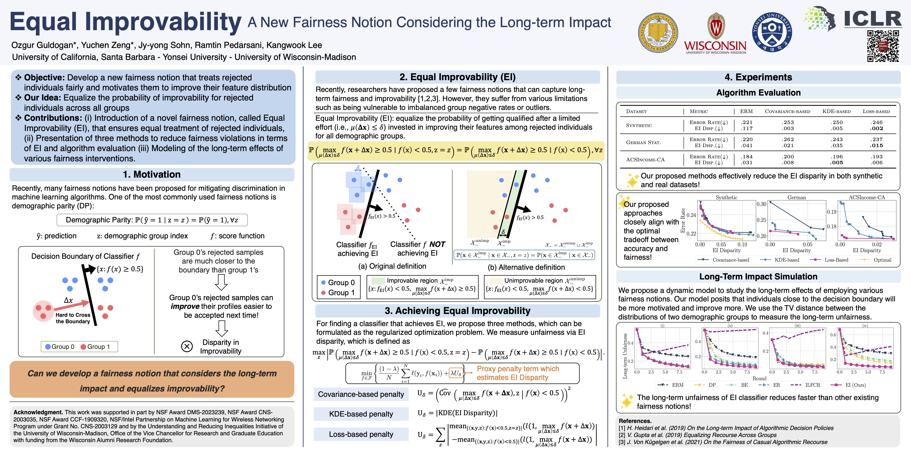

# Equal Improvability: A New Fairness Notion Considering the Long-term Impact (ICLR 2023 Poster)

The code for the paper "Equal Improvability: A New Fairness Notion Considering the Long-term Impact". 
This paper got a poster presentation at ICLR 2023! 
Links for [paper](https://openreview.net/forum?id=dhYUMMy0_Eg) and [video](https://recorder-v3.slideslive.com/?share=80966&s=eb8caaef-2818-4e2e-b687-e8d5eac09800). 

This is a joint work of [Ozgur Guldogan](https://guldoganozgur.github.io)\*, [Yuchen Zeng](https://yzeng58.github.io/zyc_cv/)\*, [Jy-yong Sohn](https://itml.yonsei.ac.kr/professor), [Ramtin Pedarsani](https://web.ece.ucsb.edu/~ramtin/), and [Kangwook Lee](https://kangwooklee.com).



## Installation instructions

First install the repo.

To create virtual environment:

```shell
cd ei_fairness
conda env create --file environment.yml
```

Note: Assuming you installed TeX. Since, the figures require TeX. To get TeX, you can follow the instructions at that [link](https://www.latex-project.org/get/).

## Reproducing Results

You can quickly replicate the outcomes described in the paper by referring to the notebooks located in the `notebooks/` directory.

## Citation

If you use this code, please consider citing our paper:
```
@inproceedings{
guldogan2023equal,
title={Equal Improvability: A New Fairness Notion Considering the Long-term Impact},
author={Ozgur Guldogan and Yuchen Zeng and Jy-yong Sohn and Ramtin Pedarsani and Kangwook Lee},
booktitle={The Eleventh International Conference on Learning Representations },
year={2023},
url={https://openreview.net/forum?id=dhYUMMy0_Eg}
}
```

## Contact

Please let us know if you have further questions or comments, you can reach out at `ozgurguldogan@ucsb.edu`, `yzeng58@wisc.edu`. 

